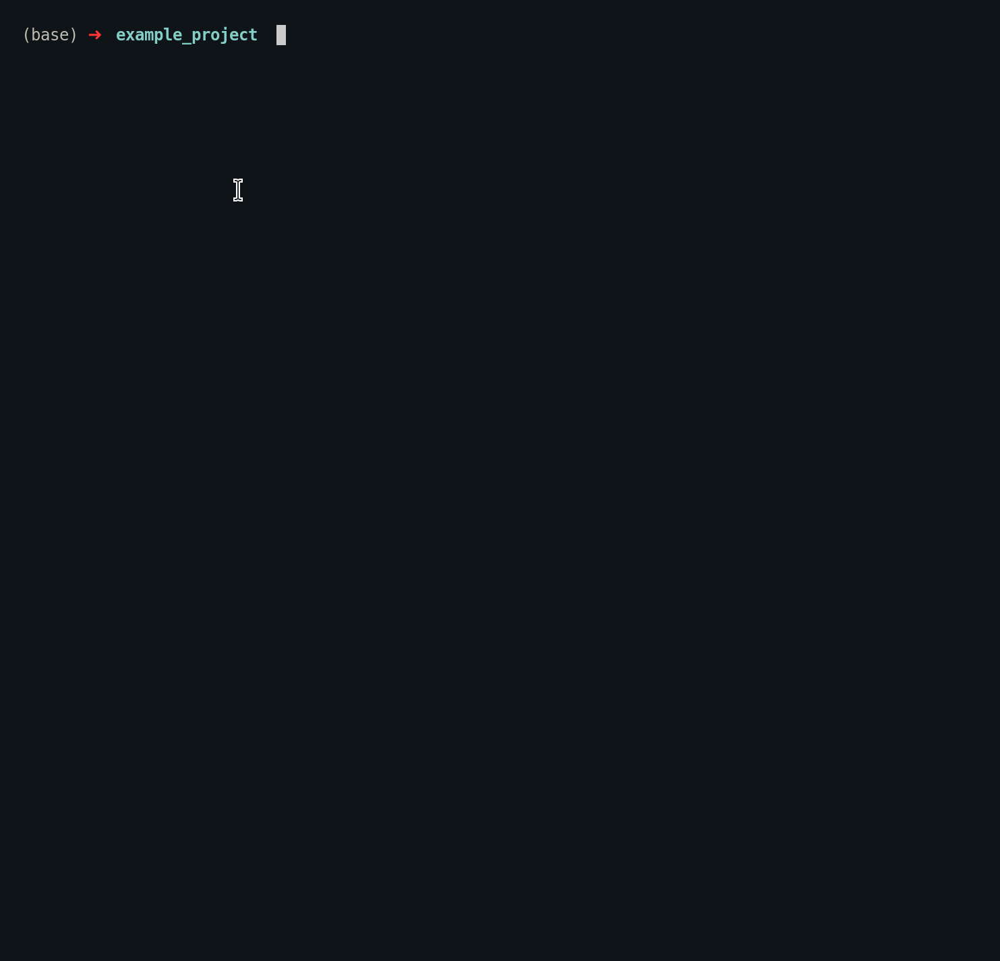

<h1 align="center"> Blindfold - a lightweight and simple .gitignore generator</h1>
<p align="center">

<br>
Logo courtesy of [Dominic Houston-Watt](https://www.instagram.com/do.graphics/)
</p>

This project makes use of gitignore.io and provides a cli to generate gitignore templates for any language of your chosing!

#### Demo:




#### Examples:
```bash
# generates a single gitignore file for both dart and flutter in ./src/.gitignore
$ blindfold --lang dart flutter
```

```bash
# you can specify a speciic destination to store the gitignore file using the dest argument
$ blindfold --lang rust --dest ./src/
```

```bash
# shows full list of available templates
$ blindfold list
```

#### Installation

NOTE: Rust must be installed on your system for this to work. 

1. Clone the repository and cd into it
2. Once in the top level directory of the repo run the command:

```bash
$ cargo install --path ./
```

This will install the binary and add it to your path. Once installed you can use the tool as shown in the examples above.

